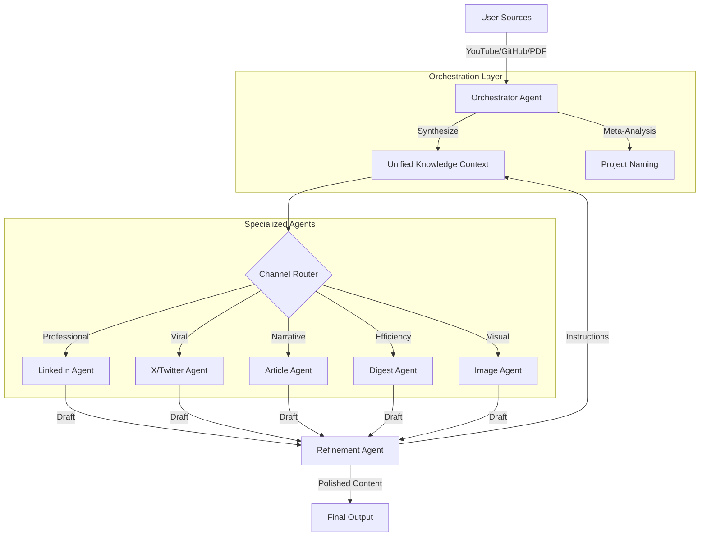

# Multi-Agent Architecture

Rizz Network operates on a sophisticated multi-agent orchestration layer designed to pipeline raw information into high-velocity intelligence. The system utilizes multiple specialized AI agents that communicate through a unified knowledge context.

## Agent Ecosystem

### 1. The Orchestrator (The Architect)
The Orchestrator is the entry point of the intelligence pipeline. Its primary roles are:
- **Data Aggregation**: Coordinating specialized scrapers for YouTube, GitHub, and Web links.
- **Context Synthesis**: Merging disparate data into a **Unified Knowledge Context**.
- **Project Branding**: Analyzing the essence of sources to generate a high-impact Project Name.

### 2. Channel Specialists (The Creators)
Once context is established, specialized agents take over based on the user's desired output:
- **LinkedIn Agent**: Transforms technical context into high-level executive insights and professional storytelling.
- **Twitter (X) Agent**: Deconstructs complex topics into viral-ready threads, hooks, and punchy insights.
- **Article Agent**: Synthesizes all source data into structured, long-form narratives with proper hierarchy.
- **Digest Agent**: Filters noise to provide rapid-fire bulleted intelligence and key takeaways.
- **Visual Agent**: Communicates with DALL-E/Gemini Imagine to create context-aware brand assets and illustrations.

### 3. Refinement Agent (The Editor)
The loop closer. This agent:
- **Feedback Processing**: Takes specific user instructions (e.g., "make it more technical", "add more rizz").
- **Iterative Drafting**: Modifies the output of Channel Agents while maintaining context integrity.

## System Diagram

## Communication Flow

1. **Information Ingestion**: Scrapers (YouTube transcript agents, GitHub repo flattener) pull raw data.
2. **Contextual Boxing**: The Orchestrator wraps this data into a JSON schema that represents the "source of truth".
3. **Task Handoff**: The Knowledge Context is passed to a Channel Agent, which carries the "Thought Process" alongside the draft.
4. **Iterative Refinement**: Instead of starting from scratch, the Refinement Agent uses the previous draft + user prompt + original context to perform surgical updates.
